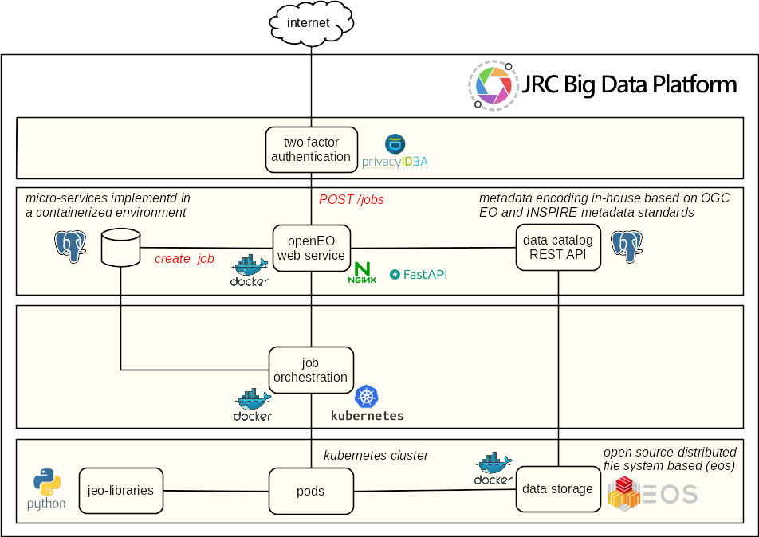
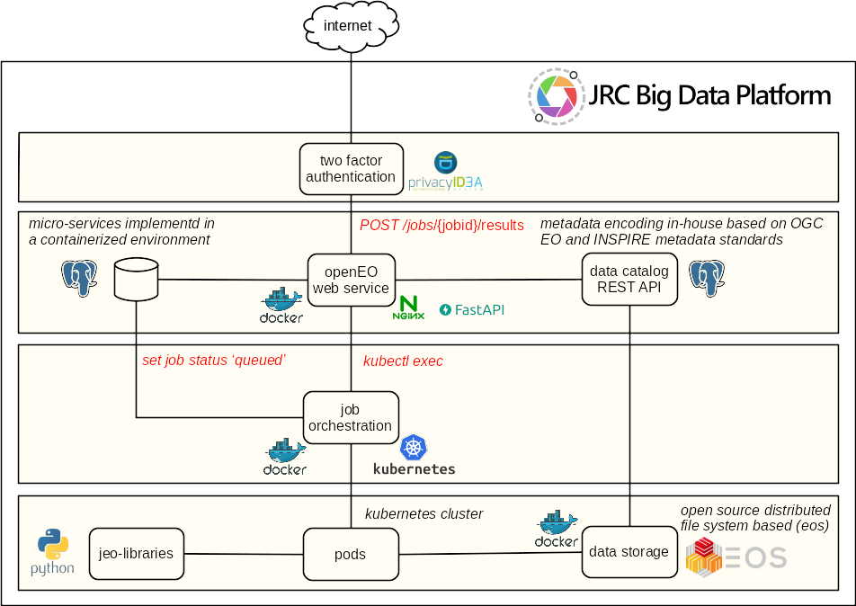
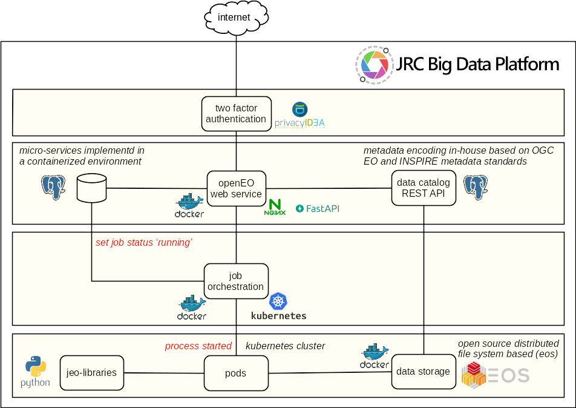

# openEO JEODPP web service and back-end

## Work flow

Client posts a job, job is created in the database

Client requests start processing batch job. Job is queued by Kubernetes and status is set to `queued` in database.

Process is started in Kubernetes cluster and status is set to `running` in database.

Process has ended and status is set to `finished` in database.

